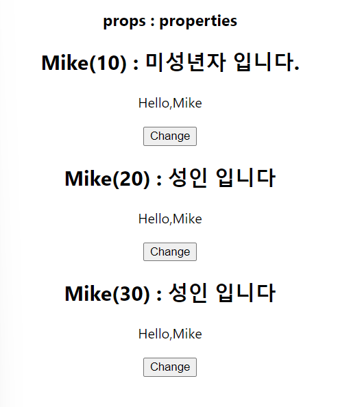
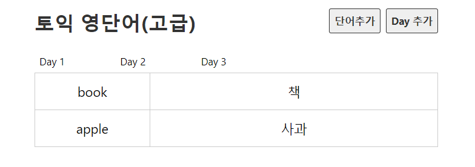

## 7. useState

- 동일한 컴포넌트를 사용자 인터랙션에 따라 바뀌어야 할 때 구현을 도와주는 react hooks 중 하나이다.
- 리액트 16.8 이후부터 Hooks라는 기능이 도입되면서 함수형 컴포넌트에서도 상태를 관리할 수 있게 되었다.
- useState는 배열값으로 반환해주는 특징을 가지고 있으며 import해서 사용해야 합니다.
- 아래예시는 화살표 함수 및 배열 구조분해를 사용하여 useState 함수 호출 시 동적으로 상태 관리가 가능하게 해주었습니다.

```
import { useState } from "react";

export default function Hello() {
  const [name, setName] = useState("Mike"); //useState 배열 반환
  return (
    <div>
      <h2 id="name">{name}</h2>
      <button
        onClick={() => {
          setName(name === "Mike" ? "Jane" : "Mike");
        }}
      >
        Change
      </button>
    </div>
  );
}
```

## 8. props(properties의 줄임말)

- state와 props은 많이 사용된다.
- 컴포넌트에 있는 state를 props로도 사용가능하다.
- props는 부모 컴포넌트가 자식 컴포넌트에게 값을 전달할때 사용하는 읽기전용 데이터이다.
- 프로퍼티는 수정할 수 없다는 특징이 있다.

## 8-1. state와 props의 활용

- 각 컴포넌트마다 name의 값이 바뀌며(state),
- 전달된 name이 UserName.js 자식 컴포넌트에서 활용되어 hello, Mike에 이름이 전달되어 name 데이터가 함께 변화되는 모습을 볼 수 있다.(props)

```
#App.js
import "./App.css";
import Hello from "./component/Hello";
import styles from "./App.module.css";

function App() {
  return (
    <div className="App">
      <h3>props : properties</h3>
      <Hello age={10} />
      <Hello age={20} />
      <Hello age={30} />
    </div>
  );
}

export default App;
```



```
# Hello.js
import { useState } from "react";
import UserName from "./UserName";

export default function Hello({ age }) {
  // let name = "Mike";
  const [name, setName] = useState("Mike"); //useState 배열 반환
  // const [age, setAge] = useState(props.age);
  const msg = age > 19 ? "성인 입니다" : "미성년자 입니다.";

  return (
    <div>
      <h2 id="name">
        {name}({age}) : {msg}
      </h2>
      <UserName name={name} />
      <button
        onClick={() => {
          setName(name === "Mike" ? "Jane" : "Mike");
          // setAge(age + 1);
        }}
      >
        Change
      </button>
    </div>
  );
}
```

```
#UserName.js
export default function UserName({ name }) {
  return <p>Hello,{name}</p>;
}
```

## 9. map() 반복문 함수와 dummy 데이터 구현

- 더미 데이터를 만들기 위해 json 생성

```
{
  "days": [
    { "id": 1, "day": 1 },
    { "id": 2, "day": 2 },
    { "id": 3, "day": 3 }
  ],
  "words": [
    {
      "id": 1,
      "day": 1,
      "eng": "book",
      "kor": "책",
      "idDone": false
    },
    {
      "id": 2,
      "day": 1,
      "eng": "apple",
      "kor": "사과",
      "idDone": false
    },
    {
      "id": 3,
      "day": 2,
      "eng": "car",
      "kor": "자동차",
      "idDone": false
    },
    {
      "id": 4,
      "day": 2,
      "eng": "pen",
      "kor": "펜",
      "idDone": false
    },
    {
      "id": 5,
      "day": 3,
      "eng": "school",
      "kor": "학교",
      "idDone": false
    },
    {
      "id": 6,
      "day": 3,
      "eng": "pencil",
      "kor": "연필",
      "idDone": false
    }
  ]
}
```

- map() 함수는 각 배열의 요소를 돌면서 인자로 전달된 함수를 사용하여 처리된 새로운 결과를 새로운 배열에 담아 반환하는 함수이다.
- 아래는 map()함수를 통해 dummy에서 days에 해당하는 요소들을 day라는 새로운 배열에 담아냈다.

```
import dummy from "../db/data.json";

export default function DayList() {
  console.log(dummy);
  return (
    <ul className="list_day">
      {dummy.days.map((day) => (
        <li key={day.id}>Day {day.day}</li>
      ))}
    </ul>
  );
}
```

- filter() 함수: 주어진 함수의 테스트를 통과하는 모든 요소를 모아 새로운 배열로 반환한다.
- filter() 함수를 통해 day가 1인 조건에 해당하는 배열을 const wordList에 담아낸다.
- wordList 배열을 map() 반복문 함수를 이용하여 테이블 형태로 한줄씩 출력한다.

```
import dummy from "../db/data.json";
export default function Day() {
  //dummy.words
  const day = 1;
  const wordList = dummy.words.filter((word) => word.day === day);
  console.log(wordList);
  return (
    <>
      <table>
        <tbody>
          {wordList.map((word) => (
            <tr key={word.id}>
              <td>{word.eng}</td>
              <td>{word.kor}</td>
            </tr>
          ))}
        </tbody>
      </table>
    </>
  );
}
```



## 10. 라우터 구현

- npm install react-router-dom 명령어로 라우터 설치
- 최근 v5에서 v6로 업그레이드 되었음.(v6부터는 Switch사용하지 않고 Route를 사용 등 바뀐부분 있음)
- 전체를 BrowserRouter로 감싸준 후 header 컴포넌트는 Routes 밖에 입력하여 웹상단에 고정으로 나오게 해줌
- Route는 path 값에 해당하는 값이 들어올때 element에 해당하는 컴포넌트를 출력해준다.

* path에서 :를 사용하여 다이나믹한 값을 변수로 담아온다.

```
## App.js
import Day from "./component/Day";
import DayList from "./component/DayList";
import Header from "./component/Header";
import { BrowserRouter, Route, Routes } from "react-router-dom";
import EmptyPage from "./component/EmptyPage";
function App() {
  return (
    <BrowserRouter>
      <div className="App">
        <Header />
        <Routes>
          <Route exact path="/" element={<DayList />} />
          <Route path="/day/:day" element={<Day />} />
          <Route path="*" element={<EmptyPage />} />
        </Routes>
      </div>
    </BrowserRouter>
  );
}

export default App;
```

- Link를 import 해서 html에서 a 태그의 href 속성에 해당하는 Link to를 사용.
- link to의 해당 url로 주소 이동.

```
## DayList.js
import { Link } from "react-router-dom";
import dummy from "../db/data.json";

export default function DayList() {
  return (
    <ul className="list_day">
      {dummy.days.map((day) => (
        <li key={day.id}>
          <Link to={`/day/${day.day}`}>Day {day.day}</Link>
        </li>
      ))}
    </ul>
  );
}
```

- useParams를 import하여 url 주소에 전달된 값을 꺼내올 수 있다.
- useParams로 전달받은 day의 값은 문자열이기 때문에 Number(day)로 감싸주어 숫자로 변환해준다.

```
## Day.js
import dummy from "../db/data.json";
import { useParams } from "react-router-dom";

export default function Day() {
  const { day } = useParams();
  const wordList = dummy.words.filter((word) => word.day === Number(day));

  return (
    <>
      <h2>Day {day}</h2>
      <table>
        <tbody>
          {wordList.map((word) => (
            <tr key={word.id}>
              <td>{word.eng}</td>
              <td>{word.kor}</td>
            </tr>
          ))}
        </tbody>
      </table>
    </>
  );
}
```

- App.js에서 Route에 등록되지 않은 모든 url주소는 EmptyPage.js로 가도록 해주었음
- 예외 주소값을 처리해준다.

```
import { Link } from "react-router-dom";

export default function EmptyPage() {
  return (
    <>
      <h2>잘못된 접근입니다.</h2>
      <Link to="/">돌아가기</Link>
    </>
  );
}
```

## 11. json-server, REST API

- 11강에서는 Word.js 컴포넌트를 만들어서 input type을 checkbox로 만들고, 함수를 이용해서 useState 사용 및 props로 {word} 입력받음
- toggleShow()와 toggleDone()함수를 통해 체크박스 클릭시 행 전체가 회색으로 바뀌면서 외운단어와 외우지 못한 단어를 시각적으로 다르게 표시해줌.

```
## Word.js
import { useState } from "react";

export default function Word({ word }) {
  const [isShow, setIsShow] = useState(false);
  const [isDone, setIsDone] = useState(word.isDone);

  function toggleShow() {
    setIsShow(!isShow);
  }
  function toggleDone() {
    setIsDone(!isDone);
  }

  return (
    <tr className={isDone ? "off" : ""}>
      <td>
        <input type="checkbox" checked={isDone} onChange={toggleDone} />
      </td>
      <td>{word.eng}</td>
      <td>{isShow && word.kor}</td>
      <td>
        <button onClick={toggleShow}>뜻 {isShow ? "숨기기" : "보기"}</button>
        <button className="btn_del">삭제</button>
      </td>
    </tr>
  );
}
```

- 작은 프로젝트에서 REST API 구축을 위해서는 JSON server를 사용하는 것이 편리하다.
- 새로운 터미널 창을 열어서 npm install -g json-server를 입력하여 설치
- 설치 완료 후 json-server --watch ./src/db/data.json --port 3001를 입력하는데, watch이후부터는 프로젝트 경로로 유동적으로 작성되는 부분 port번호도 현재 port가 아닌 다른 번호로 입력해주었음.
- 위 명령어 실행시 error 발생하여 구글링결과 문제 해결 (https://hellcoding.tistory.com/entry/VSCode-%EC%98%A4%EB%A5%98-%EC%9D%B4-%EC%8B%9C%EC%8A%A4%ED%85%9C%EC%97%90%EC%84%9C-%EC%8A%A4%ED%81%AC%EB%A6%BD%ED%8A%B8%EB%A5%BC-%EC%8B%A4%ED%96%89%ED%95%A0-%EC%88%98-%EC%97%86%EC%9C%BC%EB%AF%80%EB%A1%9C) 블로그 참조하였음.

> Rest API 이란?

- REST를 기반으로 만들어진 API로, REST는 자원을 이름으로 구분하여 해당 자원의 상태를 주고 받는 모든 것을 의미합니다.
- 즉, HTTP URI를 통해 자원(Rescource)을 명시하고, HTTP Method(POST, GET, PUT, DELETE)를 통해 해당 자원(URI)에 대한 CRUD Operation을 적용하는 것을 의미합니다.

* Create : POST
* Read : GET
* Update : PUT
* Delete : DELETE

## 12. useEffect, fetch()로 API호출

> useEffect 란?

- react hooks 중 하나로 어떤 상태값이 바뀌었을떄 동작하는 함수이며, 첫번째 매개변수로 함수를 넣는다.
- 두번째 매개변수로 count를 넣어줌으로써 count가 변화할때만 이 함수를 실행도 가능
- 이처럼 count가 변화할때마다 useEffect가 동작하는 것을 의존성 배열이라고 함. count라는 의존성 배열이 변경될 경우에만 이 함수 실행
- useEffect를 사용하는 목적 : 렌더링이 되고나서 api를 호출하기 위해 사용하며,
- 렌더링 완료후 최초 딱 한번만 api를 호출하기 위해서는 의존성 배열에 값을 넣지 않은 빈배열 입력

> fetch() 란?

- API 비동기 통신을 위해 사용
- 예전에는 클라이언트 단에서 직접 http 요청 응답 받는 것이 복잡하여 서버 단에서 API를 호출하였으나, 요즘에는 라이브러리 도움 없이도 fetch()함수를 이용하여 클라이언트단에서 api를 호출하는 것이 가능해졌다.
- fetch() 함수는 첫번째 인자로 url, 두번쨰 인자로 옵션 객체를 받고, Promise 타입의 객체를 반환한다.
- promise 후속 처리 메서드인 then을 사용하여 resolve한 객체를 전달받을 수 있다.
- 반환된 객체는 API 호출이 성공했을 경우에는 응답(response) resolve하고 실패했을 경우에는 예외(error) 객체를 reject한다.

```
import { useEffect, useState } from "react";
import { Link } from "react-router-dom";

export default function DayList() {
  const [days, setDays] = useState([]); //dummy 사용하던 것을 api에서 리스트를 가져와서 바꾸는 과정(days라는 useState 사용)

  //api 비동기 통신을 위해 fetch 사용
  useEffect(() => {
    fetch("http://localhost:3001/days")
      .then((res) => {
        return res.json();
      })
      .then((data) => {
        setDays(data);
      });
  }, []);

  return (
    <ul className="list_day">
      {days.map((day) => (
        <li key={day.id}>
          <Link to={`/day/${day.day}`}>Day {day.day}</Link>
        </li>
      ))}
    </ul>
  );
}
```

## 13. Custom Hooks 만들기

- DayList.js와 Day.js에서 json 데이터를 꺼내오는 과정에서 반복되는 로직이 발생하였다.
- Custom Hooks를 이용하면 반복되는 로직을 여러 컴포넌트에서 쉽게 사용하고 수정도 가능하다.
  \*useFetch.js 라는 이름으로 Custom Hooks를 만들었다.

> useFetch.js

```
import { useEffect, useState } from "react";

export default function useFetch(url) {
  const [data, setData] = useState([]);

  useEffect(() => {
    fetch(url)
      .then((res) => {
        return res.json();
      })
      .then((data) => {
        setData(data);
      });
  }, [url]);
  return data;
}
```

> Day.js

```import { useParams } from "react-router-dom";
import useFetch from "../hooks/useFetch";
import Word from "./Word";

export default function Day() {
  const { day } = useParams();
  const words = useFetch(`http://localhost:3001/words?day=${day}`);
  return (
    <>
      <h2>Day {day}</h2>
      <table>
        <tbody>
          {words.map((word) => (
            <Word word={word} key={word.id} />
          ))}
        </tbody>
      </table>
    </>
  );
}
```

> DayList.js

```
import { Link } from "react-router-dom";
import useFetch from "../hooks/useFetch";

export default function DayList() {
  const days = useFetch("http://localhost:3001/days");
  return (
    <ul className="list_day">
      {days.map((day) => (
        <li key={day.id}>
          <Link to={`/day/${day.day}`}>Day {day.day}</Link>
        </li>
      ))}
    </ul>
  );
}
```

- Custom Hooks를 통해 DayList.js와 Day.js 컴포넌트의 코드가 간결해졌다.
